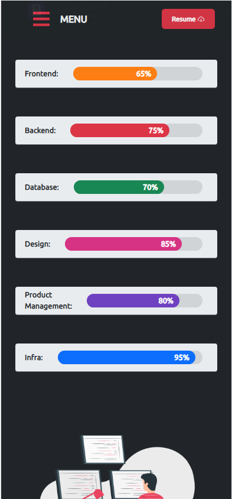

# My Portfolio

## Features

• Multi-Page Layout

• Shared Data across components

• Modern Design

• React-Icons

• Dark and Light mode theme

• PDF Download (FileURL)

• Illustrations

## How to use

① fork the repository and clone locally

② run `npm install` or `npm i`(short hand) to install dependencies

③ once installation is complete, run `npm run start` to get your local copy running in the browser.

## Template instructions

① Replace the Images
    
• In public folder there are two folders for images. Replace those images with yours and if your image have different name  then you need to change the src of img tag in particular component

② edit App.css
    
• In App.css follow the instructions for color theme and font family

③ Replace Informations
    
• In all components you need to replace my information with your's.

• Replace Name, About, Skills, Resume, Projects

• Replace my contact information links with your's inside Sidebar component

• If you want to replace Icons then visit: https://react-icons.github.io/react-icons/
     
## 👤 Author 
Edward Yara  
- GitHub: [@oluyaratosin123](https://github.com/oluyaratosin123)
- Twitter: [@TOluyara](https://twitter.com/TOluyara)
- LinkedIn: [LinkedIn](https://www.linkedin.com/in/edward-oluyara/)

## Contributing :handshake:
Contributions, issues, and feature requests are welcome!

## Show your support
Give a :star: if you like this project.
